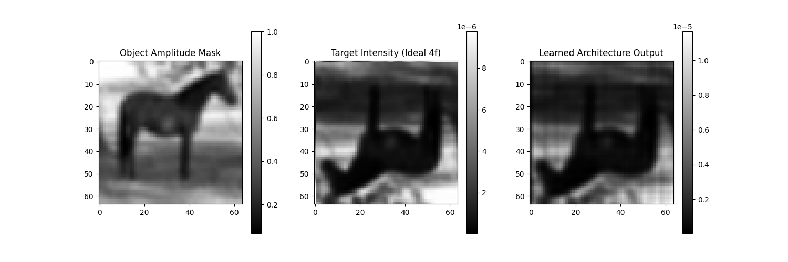

# Optical Architecture Search (OAS)

Optical Architecture Search (OAS) is the physical optics equivalent of Neural Architecture Search (NAS). Instead of discovering optimal layouts of neural network layers (e.g., Convolutions, ReLUs) for computational tasks, OAS autonomously discovers the optimal layout of **physical optical elements** (e.g., Lenses, Free-space propagation, Pupils, Gratings) to perform specific optical computations or imaging tasks.



## The Idea

Designing optical systems—such as microscopes, telescopes, or computational cameras—is traditionally a manual, intuition-driven process combined with local parameter optimization. 

OAS aims to automate the end-to-end design by jointly optimizing:
1. **Discrete Architecture Selection:** Choosing *which* optical elements to place and in *what order*.
2. **Continuous Parameter Optimization:** Tuning the physical parameters of those elements (e.g., propagation distances, focal lengths, aperture widths).

By treating wave-optics light propagation as a differentiable computational graph, we use modern machine learning frameworks ([JAX](https://github.com/google/jax) and [Chromatix](https://github.com/chromatix-team/chromatix)) to perform inverse design on the entire physical optical system.

## How It Works: The Memetic Algorithm

Initially, applying standard continuous NAS techniques (like DARTS with Gumbel-Softmax) to coherent optics fails. Taking a continuous, weighted average of complex light fields from different discrete paths causes **coherent interference**. The fields physically interfere with each other during the continuous relaxation, destroying gradient information and trapping the optimizer in non-physical local minima.

To solve this, we use a **Memetic Algorithm**—a hybrid approach combining evolutionary search with gradient descent:

1. **Evolution (Discrete Search):** A population of discrete optical architectures is maintained. A Genetic Algorithm (GA) evaluates fitness and proposes mutations (e.g., swapping a `ThinLens` for a `GaussianPupil`). Because the choices are strictly discrete during the forward pass, we completely avoid non-physical coherent mixing.
2. **Gradient Descent (Continuous Search):** For *every individual architecture* in the population, we use JAX's automatic differentiation and Optax to perform gradient descent on its underlying physical parameters (distances `z`, focal lengths `f`, widths `w`).

This effectively searches the vast discrete combinatorial space while ensuring the continuous physical parameters of each candidate are optimally tuned.

## The Search Space (Element Library)

Our framework provides a rich library of differentiable optical elements that the algorithm can select from to build the computational imaging system:

*   **Free Space:** `Propagate` (learnable distance $z$)
*   **Lenses:** `ThinLens` (learnable focal length $f$)
*   **Pupils / Apertures:** `CircularPupil`, `SquarePupil`, `GaussianPupil`, `SuperGaussianPupil`, `RectangularPupil`, `TukeyPupil` (learnable width/diameter $w$)
*   **Phase Modulators:** `Axicon` (learnable slope angle), `SawtoothGrating` (learnable period), `SinusoidGrating` (learnable period)
*   **Null:** `Identity` (pass-through)

## Supported Tasks

The system evaluates architectures based on their ability to perform specific computational imaging tasks over a dataset of varied input masks (e.g., CIFAR-10 images):

*   **Task 5.1: Coherent Amplitude Imaging** - The object modulates the amplitude of the incoming light. The target is an ideal 4f-system output. The goal is to see if the search algorithm can rediscover classical 4f-like architectures (or find novel alternatives) from scratch.
*   **Task 5.2: Phase Imaging** - The object modulates the phase of the incoming light, making it invisible to standard intensity sensors. The goal is to learn a phase-contrast architecture that automatically converts these invisible phase shifts into measurable intensity variations.

## Setup & Usage

### Installation

```bash
# Set up a Python 3.12 environment
python3.12 -m venv venv312
source venv312/bin/activate

# Install the local modified Chromatix library
cd chromatix && pip install -e . && cd ..

# Install dependencies
pip install streamlit optax torchvision matplotlib
```

### Running the GUI

We provide a highly interactive Streamlit GUI to configure the genetic algorithm, select the target task, and visualize the evolving optical schematics in real-time.

```bash
source venv312/bin/activate
streamlit run gui.py
```

## License

This project is open-source under the MIT License. See [LICENSE](LICENSE) for details.

*Note: This repository includes a vendored version of the Chromatix library with local patches for element support.*
